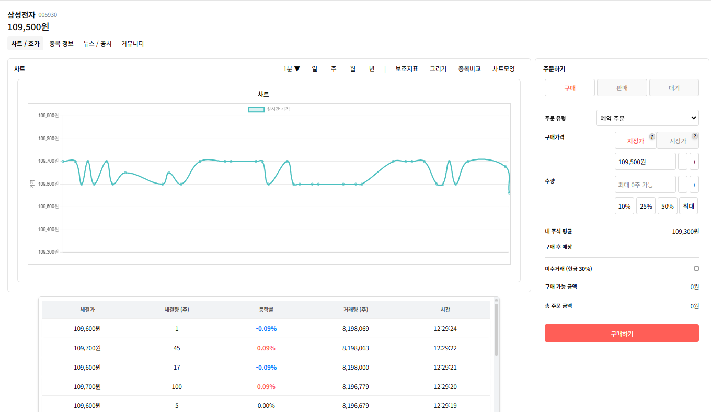
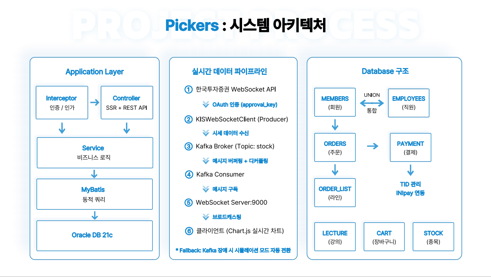
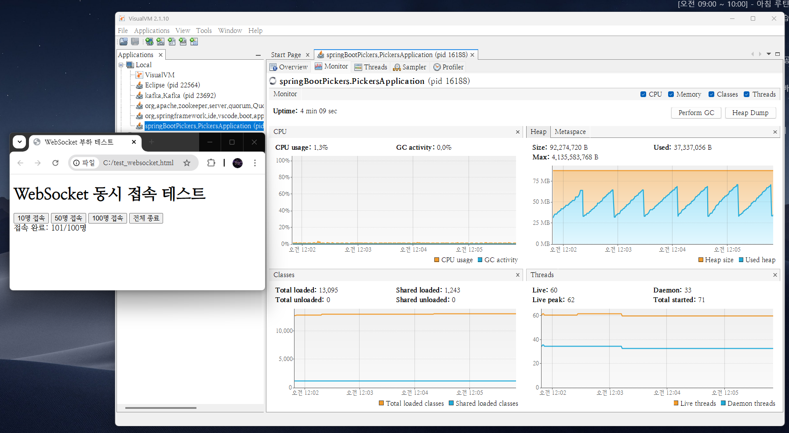

# Pickers

실시간 주식 시세를 Kafka + WebSocket으로 브라우저에 스트리밍하는 주식 교육 플랫폼입니다.  
개인 투자자 증가 추세에 맞춰 초보 투자자가 실전 투자 전 체계적으로 학습할 수 있도록 만들었습니다.

**개발 기간:** 2024.12.05 ~ 2025.01.23 (3인 팀 프로젝트)  
**수상:** 디지털 핵심 실무인재 양성 최우수상 (2025.01.23)

---

## Git 히스토리 관련

이 프로젝트는 학교 이메일로 가입한 GitHub 계정에서 작업했는데 
졸업 후 학교 계정이 삭제되면서 해당 GitHub 계정에 접근할 수 없게 되었습니다.

현재 상태:
- 최종 코드만 개인 계정으로 이관
- 프로젝트 완료 후 리팩토링한 최종 버전이 현재 저장소의 코드입니다

주요 리팩토링:
- realData 패키지 전면 개선
  - SLF4J Logger 도입 (System.out 135건 제거)
  - Graceful Shutdown (isRunning flag)
  - Kafka 없이도 동작하는 시뮬레이션 모드
  - Kafka Producer 신뢰성 옵션 (acks=all, retries=3, idempotence=true)
  
- Controller/Service 로깅 시스템 개선
  - Logger 클래스 추가 (9개 파일)
  - System.out/err 제거 (48건 → 0건)
  - printStackTrace() 제거 (3건 → 0건)
  - 로그 레벨 제어 가능

- 게시판 좋아요 기능 정규화
  - LIKE_MEMBERS 테이블 분리 (VARCHAR2 콤마 저장 → 정규화)
  - PRIMARY KEY로 동시성 제어
  - 조회 성능 대폭 개선 (문자열 스캔 제거)
  
- 결제 시스템 보안 강화
  - 이니시스 샘플 코드 Spring Boot 전환
  - 중복 결제 방지 (3중 방어: 애플리케이션 + DB + PG)
  - 금액 검증, 트랜잭션 및 동시성 제어

---

## 왜 만들었나

2024년 들어 개인 투자자 수가 급증하면서 주식 시장 진입 장벽이 낮아졌습니다.  
하지만 초보 투자자들은 기초적인 투자 지식과 실전 경험 부족으로 큰 손실을 보는 경우가 많았습니다.

이런 문제를 해결하기 위해 초보자들이 실전 투자 전에 체계적으로 학습하고,  
실시간 데이터를 보면서 시장 흐름을 파악할 수 있는 주식 교육 플랫폼을 기획했습니다.

목표:

1. 주식 학습 접근성 향상  
   초보 투자자도 쉽게 접근할 수 있는 기초 교육 제공
   
2. 체계적인 교육 콘텐츠  
   이론 학습, 데이터 분석, 실전 연습을 통해 체계적으로 투자 지식 학습

3. 실시간 데이터 제공  
   실시간 시세 차트로 실제 시장 데이터 체험

4. 사용하기 쉬운 인터페이스  
   주식에 대한 경험이 없는 사용자도 쉽게 이해하고 활용

---

## 주요 기능

### 1. 실시간 주식 시세 스트리밍
- 한국투자증권 WebSocket API 연동
- Kafka로 메시지 버퍼링
- WebSocket으로 브라우저에 실시간 전송
- Chart.js로 실시간 차트 렌더링

### 2. 주식 교육 시스템
- 용어 사전: 주식 용어 검색 및 학습
- 뉴스: 주식 관련 뉴스 제공
- 강좌 시스템: 
  - 초보자를 위한 주식 교육 강좌
  - 강좌 등록/수정/삭제 (관리자)
  - 장바구니/찜 기능
  - INIpay PG 연동 실결제
  - 수강 후기 작성

### 3. 기업 정보 관리
- 기업별 주식 정보 조회
- 실시간 시세 차트 연동
- 관리자 기업 정보 등록/수정

### 4. 커뮤니티
- 게시판 (자유/수익인증/팁/질문)
- 댓글/좋아요
- 1:1 문의
- 강의 Q&A

### 5. Fallback 처리

기동 단계 Fallback:
- Kafka 비활성화(`kafka.enabled=false`) 또는 연결 실패 시
→ 시뮬레이션 모드로 전환
→ 개발 환경에서 Kafka 없이도 실행 가능

런타임 단계 Fallback:
- Kafka 전송 실패 3회 누적 시
→ Kafka 우회하여 WebSocket 직접 브로드캐스트
→ API 실시간 데이터 유지하면서 장애 격리
- Health Check(30초 간격)로 Kafka 복구 시 자동 전환

### 실행 화면


*Chart.js를 활용한 실시간 시세 차트*

---

## 기술 스택

Backend
- Spring Boot 3.3.6
- MyBatis 3.0.3
- Oracle 21c
- Spring Security

Messaging
- Apache Kafka 3.7.0
- WebSocket (Java-WebSocket 1.5.2)
- 한국투자증권 Open API

Frontend
- Thymeleaf
- jQuery/AJAX
- Chart.js

Payment
- INIpay PG 연동

Testing
- VisualVM (메모리 프로파일링)

---

## 아키텍처

### 실시간 데이터 파이프라인



핵심 특징:
- Producer-Consumer 분리: API 수신과 브로드캐스트 로직 독립
- 비동기 메시지 큐: Kafka로 Producer-Consumer 분리 및 메시지 버퍼링
- Health Check 기반 Fallback: Kafka/API 장애 시 자동 전환

---

## 프로젝트 구조

```
Pickers/
├── src/main/java/springBootPickers/
│   ├── realData/              # Kafka + WebSocket 실시간 파이프라인 (리팩토링 완료)
│   ├── controller/            # REST Controller (로깅 시스템 개선 완료)
│   ├── service/               # 비즈니스 로직 (로깅 시스템 개선 완료)
│   ├── domain/                # DTO
│   └── mapper/                # MyBatis Mapper
├── docs/                      # 기술 문서 및 테스트 결과
│   ├── images/                # README 이미지
│   └── WebSocket_동시_접속_테스트.pdf
└── src/main/resources/
    ├── application.properties.example
    └── templates/             # Thymeleaf 템플릿
```

---

## 실행 방법

### 환경 설정

이 프로젝트는 보안을 위해 `application.properties` 파일을 GitHub에 포함하지 않았습니다.  
실행 전에 다음 단계를 따라 설정 파일을 준비하세요.

#### 1. 설정 파일 생성

```bash
# application.properties.example을 복사
cp src/main/resources/application.properties.example src/main/resources/application.properties
```

#### 2. 필수 설정 값 입력

`src/main/resources/application.properties` 파일을 열고 다음 값들을 본인 환경에 맞게 수정:

```properties
# DB 설정
spring.datasource.username=YOUR_DB_USERNAME
spring.datasource.password=YOUR_DB_PASSWORD

# 이메일 설정 (Gmail 앱 비밀번호)
spring.mail.username=YOUR_EMAIL@gmail.com
spring.mail.password=YOUR_EMAIL_APP_PASSWORD

# NewsAPI 키 (https://newsapi.org 에서 발급)
newsapi.key=YOUR_NEWSAPI_KEY

# 한국투자증권 API 키 (https://apiportal.koreainvestment.com 에서 발급)
kis.app-key=YOUR_KIS_APP_KEY
kis.app-secret=YOUR_KIS_APP_SECRET
```

#### 3. 외부 라이브러리

이 프로젝트는 INIpay PG 연동을 위해 `libs/` 폴더의 jar 파일을 사용합니다.  
Maven Central에 없는 라이브러리이므로 로컬 jar로 포함했습니다.

---

### 1. 실제 데이터 사용 (한국투자증권 API)

필수 준비:
- Oracle DB 설치 및 실행
- Zookeeper 실행
- Kafka 실행
- 한국투자증권 API 키 발급 ([링크](https://apiportal.koreainvestment.com))

실행:
```bash
# 1. Zookeeper 실행 (Kafka 설치 디렉토리의 bin/windows 폴더에서)
zookeeper-server-start.bat ..\..\config\zookeeper.properties

# 2. Kafka 실행 (새 터미널에서, 동일한 경로)
kafka-server-start.bat ..\..\config\server.properties

# 3. application.properties에서 Kafka 활성화 확인
kis.realtime.enabled=true
kafka.enabled=true

# 4. Spring Boot 실행
./mvnw spring-boot:run
```

접속:
- http://localhost:8080/chart/detail?stockNum=000001

---

### 2. 시뮬레이션 모드 (Kafka 없이)

Kafka 설치 없이 개발 환경에서 바로 테스트 가능합니다.

실행:
```bash
# application.properties 설정
kis.realtime.enabled=true
kafka.enabled=false

# Spring Boot 실행
./mvnw spring-boot:run
```

랜덤 주가 데이터가 1초마다 생성되면서 실시간으로 차트에 표시됩니다.

---

## 성능 테스트 결과

### WebSocket 동시 접속 테스트

목적: 메모리 누수 검증 및 확장성 확인  
도구: VisualVM 2.1.10  
테스트 방법:
- Chrome 브라우저에서 JavaScript WebSocket API로 동시 접속
- VisualVM으로 JVM Heap 메모리 실시간 모니터링

| 접속자 수 | Used Heap | 증가량 | 접속자당 메모리 |
|----------|-----------|--------|----------------|
| 기본 (0명) | 38 MB | - | - |
| 10명 | 45 MB | +7 MB | 0.7 MB/명 |
| 50명 | 57 MB | +19 MB | 0.38 MB/명 |
| 100명 | 74 MB | +36 MB | 0.36 MB/명 |
| GC 후 | 38 MB | -36 MB | - |


*100명 접속 후 GC 동작 시 Base Heap 38MB로 복구*

결과:
- 100명 동시 접속 시 74MB로 안정적 유지
- GC 후 Base Heap 38MB 복구 → 테스트 범위 내 메모리 누수 없음
- 접속자당 평균 0.36MB 소비 (효율적)
- 메모리 기반 추정: 수천 명 규모까지 확장 가능

기술적 검증:
- `ConcurrentHashMap`으로 스레드 안전한 연결 관리
- `onClose()` 시 자동 `remove()` 동작 확인
- GC를 통한 메모리 회수 정상 작동

상세 테스트 결과: [docs/WebSocket_동시_접속_테스트.pdf](docs/WebSocket_동시_접속_테스트.pdf)

---

## 리팩토링 내역

프로젝트 완료 후 코드 품질 개선을 위해 전면 리팩토링을 진행했습니다.

### 주요 개선 사항

#### 1. realData 패키지 전면 개선

**AS-IS (팀 프로젝트 당시):**
- MultiThreadedUDPServer 사용 (UDP 서버 의존)
- System.out/printStackTrace로 로깅 (135건)
- Graceful Shutdown 없음 (강제 종료만 가능)
- 내부 UDP 서버 의존 (172.16.110.46, 특정 네트워크에서만 실행)
- Kafka 필수 (Kafka 없으면 실행 불가)
- 삼성전자 1종목 고정

**TO-BE (리팩토링 후):**
- Logger 도입 (SLF4J): System.out 135건 제거
- Graceful Shutdown: isRunning flag로 안전한 종료
- 시뮬레이션 모드 추가: Kafka 없이도 동작
- Kafka Producer 신뢰성 옵션: acks=all, retries=3, idempotence=true
- Health Check 자동 복구 (30초 간격)
- 한국투자증권 API 전환: 어디서든 실행 가능
- 코드 한 줄로 다양한 주식 종목 추가 가능
- 신규 클래스 3개 추가:
  - `KISApiService.java` (한국투자증권 API 연동)
  - `KISWebSocketClientWithKafka.java` (Kafka Producer)
  - `RealTimeStockServiceWithKafka.java` (통합 실행 관리)

#### 2. Controller/Service 로깅 시스템 개선
- Logger 클래스 추가: 9개 파일
- System.out/err 제거 (48건 → 0건)
- printStackTrace() 제거: 3건 → 0건
- 운영 모니터링 준비: 로그 레벨 제어 가능

개선된 파일 목록:

Controller (3개):
- BoardController.java
- WordController.java
- OrdersController.java

Service (6개):
- INIstdpayPcReturn.java
- BoardDetailService.java
- BoardDeleteService.java
- LectureOrderService.java
- WordDetailService.java
- AutoNumService.java

#### 3. 게시판 좋아요 기능 정규화
- LIKE_MEMBERS 테이블 분리: VARCHAR2 콤마 저장 → 정규화
- PRIMARY KEY로 동시성 제어: 애플리케이션 레벨 체크 불필요
- 조회 성능 최적화: INSTR 전체 스캔 → PK 인덱스 기반 조회
- 무제한 확장: VARCHAR2(4000) 제한 제거

#### 4. 결제 시스템 보안 강화

이니시스 PG 샘플 코드를 Spring Boot로 전환하고 보안 취약점을 개선했습니다.

**트랜잭션 및 동시성 제어:**
- @Transactional 적용: 주문 생성, 결제 콜백, 결제 취소
- Sequence 기반 주문번호 생성: 동시 주문 Race Condition 방지

**보안 검증 추가 (샘플 코드에 없던 부분):**
- 중복 결제 방지: DB 조회 + UNIQUE 제약조건 + PG 차단
- 금액 검증: DB 주문 금액 vs PG 결제 금액 비교
- 상태 검증: pay_status 기반 결제 가능 여부 확인

**개선된 파일:**
- INIstdpayPcReturn.java (결제 콜백 처리)
- IniPayReqService.java (보안 설정 분리)
- LectureOrderService.java (트랜잭션 적용)
- OrdersController.java (RESTful 준수, 예외 처리)

**개선 효과:**
- 데이터 정합성 보장 (에러 시 자동 롤백)
- 중복 결제, 금액 변조 방지
- RESTful 원칙 준수 (POST 방식 데이터 삭제)

#### 5. 설정 파일 개선 (application.properties)

하드코딩되어 있던 보안 정보를 properties 파일로 외부화했습니다.

- PG 설정: inicis.mid, inicis.signkey (IniPayReqService.java에서 @Value 주입)
- 한국투자증권 API: kis.app-key, kis.app-secret 등 4개 설정
- 트랜잭션 설정: auto-commit=false

**개선 효과:**
- 하드코딩 제거 (보안 강화)
- 환경별 설정 분리 (개발/운영)
- Git 민감 정보 노출 방지

#### 6. 실행 편의성 향상
- Java 실행 통합: 3개 → 1개 (67% 감소)
- 총 프로그램: 5개 → 1-3개 (40-80% 감소)
- 코드 복사: 4개 파일 → 0개
- Kafka 의존성: 필수 → 선택 가능 (시뮬레이션 모드)

### 정량적 개선

| 지표 | 개선 |
|------|------|
| Logger 클래스 추가 | 12개 (realData 3개 + Controller/Service 9개) |
| System.out/err 제거 | 183건 (realData 135건 + Controller/Service 48건) |
| printStackTrace() 제거 | 3건 |
| Graceful Shutdown | 구현 완료 |
| 시뮬레이션 모드 | 구현 완료 |
| Kafka Producer 신뢰성 | acks=all, retries=3, idempotence 적용 |
| 데이터 정규화 | LIKE_MEMBERS 테이블 분리 |
| 조회 성능 | 인덱스 기반 조회로 대폭 개선 |
| 결제 트랜잭션 | @Transactional 적용 |
| 동시성 제어 | Sequence 기반 주문번호 |
| 결제 보안 검증 | 중복 결제, 금액, 상태 검증 추가 |
| 설정 파일 개선 | 9개 설정 추가 (PG, KIS API, 트랜잭션, 로깅) |

---

## 어려웠던 점과 해결 과정

### 1. 실행 통합 및 자동화

문제:  
처음엔 실시간 파이프라인이 3개 프로그램으로 분리되어 있었습니다.
- MultiThreadedUDPServer (UDP → Kafka Producer)
- KafkaWebSocketServer (Kafka Consumer → WebSocket)
- Spring Boot (메인 애플리케이션)

매번 3개를 따로 실행해야 했고, 외부 프로젝트(C:\src\multithread)에서  
코드를 복사해야 했으며, 내부 UDP 서버(172.16.110.46)에 의존해서  
특정 네트워크에서만 개발이 가능했습니다.

해결:  
개발 효율과 환경 독립성을 위해 세 가지를 진행했습니다.

1) 실행 통합: Spring Boot에 Producer-Consumer 로직을 통합하고,  
   CommandLineRunner로 자동 시작되도록 구현

2) 데이터 소스 변경: 내부 UDP 서버에서 한국투자증권 API로 변경하여
   어디서든 개발 가능하도록 개선
   
3) 종목 확장성: 전 UDP 서버는 삼성전자 1개만 고정되어 있어
   다른 종목을 추가할 수 없었습니다.
   
   한국투자증권 API는 subscribeStockPrice() 메서드를
   한 줄 추가하는 것만으로 원하는 종목을 자유롭게 구독할 수 있습니다.
```java
// OLD: 삼성전자 1개만 고정
// UDP 서버가 보내주는 대로만 수신

// NEW: 코드 한 줄 추가로 확장 가능
subscribeStockPrice("005930"); // 삼성전자
subscribeStockPrice("000660"); // SK하이닉스 추가
subscribeStockPrice("035720"); // 카카오 추가
```
```java
@Component
public class RealTimeStockServiceWithKafka implements CommandLineRunner {
    @Override
    public void run(String... args) {
        // Kafka 연결 확인
        if (!kafkaEnabled || !testKafkaConnection()) {
            wsServer.startSimulationMode();
            return;
        }
        
        // 한국투자증권 API 연결
        String approvalKey = apiService.getApprovalKey(appKey, appSecret);
        KISWebSocketClientWithKafka kisClient = 
            new KISWebSocketClientWithKafka(websocketUrl, approvalKey);
        kisClient.connect();
        
        // Kafka Consumer 시작
        wsServer.startKafkaConsumer();
    }
}
```

결과:  
- 실행 프로그램: 5개 (Zookeeper, Kafka, 3개 Java) → 3개 또는 1개
- Java 실행 통합: 3개 → 1개 (67% 감소)
- 코드 복사: 4개 파일 → 0개
- 장소 제약 제거: 특정 네트워크 의존 → 어디서든 실행 가능
- 종목 확장: 삼성전자 1개 고정 → 코드 한 줄 추가로 여러 종목 확장
- 시뮬레이션 모드로 Kafka 없이도 테스트 가능

---

### 2. WebSocket 동시성 및 메모리 관리

문제:  
동시 접속이 증가하면 메모리 누수가 생길까 우려됐습니다.  
특히 사용자가 페이지를 닫거나 비정상 종료되면  
서버 쪽 연결이 남아있어서 좀비 세션이 쌓일 수 있다는 걱정도 있었습니다.

해결 및 검증:  
먼저 ConcurrentHashMap으로 스레드 안전하게 세션을 관리하고,  
VisualVM으로 100명 동시 접속 테스트를 진행했습니다.

```java
// 스레드 안전한 세션 관리
private Set<WebSocket> connections = ConcurrentHashMap.newKeySet();

@Override
public void onOpen(WebSocket conn, ClientHandshake handshake) {
    connections.add(conn);
}

@Override
public void onClose(WebSocket conn, int code, String reason, boolean remote) {
    connections.remove(conn);
}

// 좀비 세션 방지
setConnectionLostTimeout(60);  // 60초 무응답 시 자동 해제
```

결과:  
- 접속자당 평균 0.36MB 소비 (효율적)
- GC 후 Base Heap 38MB 복구 → 테스트 범위 내 메모리 누수 없음 검증
- 60초 무응답 연결 자동 해제로 좀비 세션 방지
- `ConcurrentHashMap.newKeySet()`이 스레드 안전하게 관리

---

### 3. 결제 시스템 보안 취약점 발견 및 개선

문제:  
이니시스에서 제공한 샘플 코드를 분석하던 중 보안 취약점을 발견했습니다.
- 중복 결제 방지 없음 (브라우저 뒤로가기 → 재결제 가능)
- 금액 검증 없음 (개발자 도구로 금액 변조 가능)
- 상태 검증 없음 (이미 결제 완료된 주문도 재결제 가능)

이런 취약점들은 실제 금전적 손실로 이어질 수 있어서 개선이 필요했습니다.

해결:  
3중 방어 체계를 설계했습니다.

1단계 - 애플리케이션 레벨:
```java
PaymentDTO existingPayment = orderRepository.getPayment(orderNum);
if (existingPayment != null) {
    throw new RuntimeException("이미 결제 완료된 주문입니다");
}
```

2단계 - DB 레벨:
```sql
ALTER TABLE PAYMENT 
ADD CONSTRAINT UK_PAYMENT_ORDER_NUM UNIQUE (ORDER_NUM);
```

3단계 - PG 레벨:
- 이니시스 자체적으로 중복 승인 차단 ("승인요청 완료건" 에러)

금액 검증:
```java
int expectedPrice = order.getOrderPrice();  // DB 주문 금액
int paidPrice = Integer.parseInt(resultMap.get("TotPrice"));  // PG 결제 금액
if (expectedPrice != paidPrice) {
    throw new RuntimeException("결제 금액이 일치하지 않습니다");
}
```

추가 개선:
- @Transactional로 데이터 정합성 보장
- Sequence 기반 주문번호 생성 (동시성 제어)
- 보안 설정 분리 (@Value)
- RESTful 원칙 준수 (POST 방식 삭제)

결과:  
- 중복 결제 완전 차단 (3중 방어)
- 금액 변조 방지
- @Transactional로 데이터 정합성 보장
- 주문 생성부터 결제 완료까지 트랜잭션 일관성 확보

---

## 배운 점

### 1. 실시간 메시징 아키텍처 학습

한국투자증권 API 데이터를 WebSocket으로 바로 브로드캐스트하는 방식도 가능했지만,
수신과 전송을 분리해 단계별로 개발·테스트·교체가 가능하도록 Kafka를 적용했습니다.
규모 대비 오버헤드는 있으나, Producer-Consumer 패턴을 직접 학습하고 싶었습니다.

배운 점:
- Producer-Consumer 패턴으로 시스템 컴포넌트를 분리하는 방법
- 메시지 큐가 시스템 간 결합도를 낮추는 원리
- 메시지 버퍼링으로 시스템 안정성을 확보하는 메커니즘

특히 실감한 부분:
- Producer/Consumer를 독립적으로 개발·테스트할 수 있어 개발/검증이 쉬워짐
- 한 부분의 문제가 전체 시스템에 전파되지 않는 구조를 체감함

리팩토링하면서 Kafka 없이도 동작하도록 Fallback을 추가하여,
데이터 소스(실데이터/시뮬레이션)를 유연하게 전환할 수 있게 개선했습니다.

---

### 2. 성능 측정의 중요성

처음에는 "100명이 동시 접속했을 때 안정적으로 잘 운영될까?" 궁금해서
VisualVM으로 측정해보니 예상과 다른 패턴이 나왔습니다.

| 접속자 | 메모리/명 | 분석 |
|--------|----------|------|
| 10명 | 0.7MB | JVM 초기 오버헤드가 큼 |
| 100명 | 0.36MB | 오버헤드가 분산되면서 효율 증가 |

왜 이런 결과가 나왔는지 찾아봤더니:
- `ConcurrentHashMap` 같은 자료구조는 초기 용량 할당 비용이 큼
- 사용자가 많아질수록 1인당 고정 비용이 분산됨
- JVM 워밍업 이후 최적화 효과도 있음

단순히 "선형 증가"를 예상했는데, 실측으로 다른 패턴을 발견하고  
그 이유까지 파악하는 과정에서 많이 배웠습니다.

---

### 3. 운영 관점의 코드 작성

프로젝트 당시에는 "기능 동작"에만 집중했는데,  
리팩토링하면서 "어떻게 종료되는가"까지 고민하게 됐습니다.

Spring Boot가 꺼질 때 WebSocket 연결과 Kafka Consumer를  
안전하게 종료하는 Graceful Shutdown을 구현했습니다.

```java
@PreDestroy
public void cleanup() {
    log.info("Spring Boot 종료 감지 - 리소스 정리 시작");
    
    if (kisClient != null) {
        kisClient.shutdown();  // isRunning = false 설정
    }
    
    if (wsServer != null) {
        wsServer.shutdown();  // Kafka Consumer close()
    }
    
    log.info("리소스 정리 완료");
}
```

실무에서는 이런 부분이 중요하다는 걸  
직접 구현해보면서 체감했습니다.

---

### 4. 리팩토링으로 얻은 깊이 있는 이해

프로젝트 당시에는 기능 구현에 집중했는데,  
완료 후 `System.out`을 왜 쓰면 안 되는지 궁금해져서 찾아봤습니다.

로그 레벨 제어가 안 되고, 성능에도 영향을 준다는 걸 알게 되었고,  
realData 패키지 전체를 SLF4J로 바꾸면서 Logger의 필요성을 체감했습니다.

Kafka 설정도 처음엔 기본값만 썼는데,  
`acks=all`, `idempotence=true` 같은 옵션들이 왜 필요한지  
하나씩 찾아보면서 메시지 신뢰성 개념을 이해하게 됐습니다.

구현할 때는 "돌아가게" 만드는 데 급급했다면,  
리팩토링하면서 "왜 이렇게 해야 하는지"를 알게 됐습니다.

---

### 5. 데이터 정규화와 동시성 제어

프로젝트 당시에는 기능 동작에만 집중했는데,  
좋아요 기능을 리팩토링하면서 데이터 정규화와 동시성 제어의 중요성을 알게 됐습니다.

문제:  
VARCHAR2 컬럼에 콤마로 회원번호를 저장하니  
약 200명까지만 좋아요가 가능했고, 동시 요청 시 중복 위험이 있었습니다.

```
기존: BOARD.LIKE_MEMBERS = ",mem001,mem003,"
제한: VARCHAR2(4000) ≈ 200명
조회: INSTR 함수로 문자열 전체 스캔
```

해결:  
LIKE_MEMBERS 테이블을 분리하고, (게시글, 회원) 복합 PK로  
DB 제약조건 레벨에서 중복을 자동으로 방지했습니다.

```sql
CREATE TABLE LIKE_MEMBERS (
    BOARD_NUM VARCHAR2(30),
    MEM_NUM VARCHAR2(30),
    LIKED_DATE DATE DEFAULT SYSDATE,
    CONSTRAINT PK_LIKE_MEMBERS PRIMARY KEY (BOARD_NUM, MEM_NUM),
    CONSTRAINT FK_LIKE_BOARD FOREIGN KEY (BOARD_NUM) 
        REFERENCES BOARD(BOARD_NUM) ON DELETE CASCADE
);
```

배운 점:  
- 정규화로 확장성과 성능을 동시에 확보
- DB 제약조건으로 애플리케이션 레벨 체크 불필요
- PRIMARY KEY 인덱스로 빠른 조회 성능 (문자열 스캔 제거)
- 동시 요청 시 PK가 자동으로 중복 차단

결과:  
- 무제한 확장 가능
- 조회 성능 대폭 개선 (문자열 스캔 → 인덱스 기반 조회)
- 동시성 안전
- 좋아요 시간 추적 가능 (LIKED_DATE)

---

## 팀 역할 분배

정준교 (팀장, 본인)
- 실시간 데이터 파이프라인 설계 및 구현 (Kafka + WebSocket)
- 한국투자증권 API 연동
- 주문/결제 시스템 (INIpay PG 연동)
- 장바구니/찜 기능
- 주식 / 용어 / 게시판 등록 및 관리

박다영
- 회원 등록 및 관리
- 직원 등록 및 관리 
- 로그인/로그아웃 및 세션 관리
- 아이디/비밀번호 찾기
- 자동 로그인 구현
- 뉴스 등록 및 관리

박연우
- 강의 등록 및 관리
- 강의 Q&A 시스템
- 기업 정보 등록 및 관리
- 1:1 문의 시스템
- 주식 교육 콘텐츠 페이지

공통
- UI/UX 디자인
- 데이터 모델링 및 DB 설계

---

## 라이선스

이 프로젝트는 학습 목적으로 제작되었습니다.

---

## 연락처

이메일: jpb1632@gmail.com
GitHub: https://github.com/jpb1632
